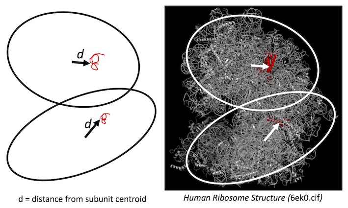

# Ribosomal Protein Analysis
Hamilton, R.S.<sup>1,2</sup>

<sup>1</sup> Centre for Trophoblast Research,
<sup>2</sup> Department of Physiology, Development, & Neuroscience, University of Cambridge, Downing Site, Cambridge, CB2 3DY,


## Publication ##
Hamilton, R.S. (2019) DOI

## Abstract ##

To be added




## Downloading and pre-processing ribosome structure CIF and annotation files ##

#### Ribosome 3D Coordinates (CIF) ####

Download the human 80s ribosome structure from [RCSB: 6EK0.cif](https://files.rcsb.org/download/6EK0.cif)

#### PDB Website SOURCE ####

    cat 6EK0.source.copy.txt | grep -v "^Protein" | grep -v "^Full" | \
    grep -v "^Molecule" | grep -v "^Find" | grep -v "Mutations" | \
    sed 's/Entity ID: //g' | sed 's/Gene Names: //g' > 6EK0.source.copy.ed.txt

## Calculating Ribosomal Protein Surface Scores ##

    perl RibosomeStructure.pl 6ek0.cif 6EK0.source.copy.ed.csv

Output

    40s: Cn   Dist Description
    40s: SG 113.84 S6; RPS6
    40s: SI 107.44 S8; RPS8
    40s: SM 100.57 S12; RPS12
    40s: Sf  98.14 Ubiquitin-S27a; RPS27A (UBA80 UBCEP1)
    40s: SZ  96.58 S25; RPS25


## Visualisation using Pymol ##

    viewport 1000,1000
    set ignore_case, off

    Out
    Rpl19, Rps5, Rpl14, Rps18, Rpl17, Rpl24, Rpl26, Rps12, Rps3a, Rps9, Rps4x, Rpl23a, Rpl9

    colour red, chain LR (SF, LM, SS, LP, LW, LY, SM, SB, SJ, SE, LX, LH)


    > MaxABDiff.ribo.cntl[ (MaxABDiff.ribo.cntl$CntrMeanDiff > mean(MaxABDiff.ribo.cntl$CntrMeanDiff)), ]$external_gene_name

    Rpl36a Rpl35a Rps26  Rpl34


    colour red, chain LR #Rpl19
    colour red, chain SF #Rps5
    #colour red, chain LF #Rpl7   
    #colour red, chain #Rpl12
    colour red, chain LW #Rpl24


## Create MPG movies from Pymol PNG ##

 ````
 convert -delay 6 -quality 99 <filename>_*.png <filename>_movie.mpg
 ````

## References ##


### Links ###

Description   | URL
------------- | ----------
Publications  | [bioRxiv](http://), [Journal](http://) and [DOI](http://) <br>(<i>To be updated on publication</i>)

## Contact ##

Contact rsh46 -at- cam.ac.uk
